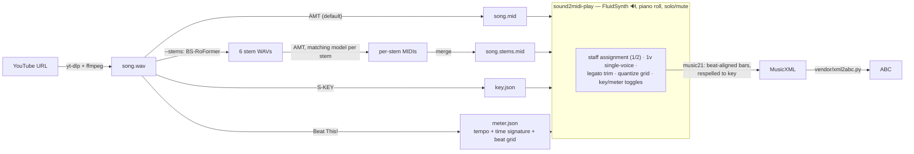

# sound2midi

Download a YouTube video's audio and transcribe it to MIDI using
[instrument-agnostic-amt](https://github.com/anime-song/instrument-agnostic-amt),
then play the result back with per-instrument solo/mute and a piano-roll view.

Built on the Astral stack: [`uv`](https://docs.astral.sh/uv/) for packaging,
[`ruff`](https://docs.astral.sh/ruff/) for lint/format, and
[`ty`](https://github.com/astral-sh/ty) for type checking.

## How it works



`sound2midi` itself is a lightweight orchestrator. Because the AMT project is a
script-based repo with a CUDA-pinned torch, it is **not** mixed into this project's
dependencies. Instead, on first use it is cloned into a cache directory with its own
`uv`-managed virtualenv, and its code is run as a subprocess.

## Requirements

- `uv`, `git`, and `ffmpeg` on your PATH.
- An NVIDIA GPU is strongly recommended. The AMT model pins `torch==2.7.0+cu128`
  (CUDA 12.8, with Blackwell/RTX-50 support). CPU inference works via `--device cpu`
  but is very slow.
- For the player: a FluidSynth soundfont. On Debian/Ubuntu: `sudo apt install
  fluid-soundfont-gm` (provides `/usr/share/sounds/sf2/FluidR3_GM.sf2`). The synth
  library itself ships with the `pyfluidsynth` wheel.

## Setup

```bash
uv sync                          # this project's deps + dev tools
uv sync --extra player           # ...also install the MIDI player GUI (PySide6 etc.)
uv run sound2midi --setup-only   # clone AMT + build its venv (downloads ~3GB of torch)
```

`--setup-only` is optional; the AMT environment is built automatically on first run.

## Transcribe

Each song gets its own folder under `output/` (override with `-O/--output-dir`):

```
output/<song>/
  <song>.wav         # downloaded audio
  <song>.mid         # single-model transcription
  <song>.stems.mid   # merged stem transcription (with --stems)
  <song>.key.json    # detected musical key (skey)
  <song>.meter.json  # detected tempo + time signature + beat grid (beat-this)
  stems/             # stem intermediates (separated WAVs + per-stem MIDIs)
```

```bash
# YouTube URL or bare id -> output/<id>/<id>.mid
uv run sound2midi "https://www.youtube.com/watch?v=VIDEO_ID"
uv run sound2midi VIDEO_ID

# Pick the model variant; transcribe a local file (kept in place, outputs still go to output/)
uv run sound2midi VIDEO_ID --type guitar
uv run sound2midi ./song.wav

# Force CPU / disable mixed precision / forward raw infer.py flags
uv run sound2midi <url> --device cpu --no-amp
uv run sound2midi <url> --infer-arg=--velocity --infer-arg=110
```

### Re-runs are cheap (idempotent)

The audio is reused if already downloaded, and transcription is skipped if the target
MIDI already exists. Pass `-f/--force` to redo from scratch.

### Single-model vs stem-separated

By default a single model transcribes the whole mix in one pass — fast, and the
baseline to compare against.

`--stems` replicates the upstream Colab's optional workflow: it separates the audio
into stems (bass / drums / other / vocals / guitar / piano via BS-RoFormer),
transcribes **each stem with its matching AMT model** (`drums→drums`, `bass→bass`,
`vocals→vocal_harmony`, `guitar→guitar`, `other→other`, else `default`), then merges
the per-stem MIDIs into one file. It's slower and downloads several model checkpoints,
but usually separates instruments more cleanly (e.g. it recovers a real drum track).

```bash
uv run sound2midi VIDEO_ID --stems          # -> output/<id>/<id>.stems.mid
uv run sound2midi VIDEO_ID --stems --no-drums
uv run sound2midi VIDEO_ID --stems --cleanup-stems   # delete separated WAVs afterward
```

The stem pipeline is **resumable**: already-separated stems and already-written per-stem
MIDIs are reused, and if the child process dies on a signal (an intermittent native
SIGSEGV has been seen in the torch/CUDA stack) it is retried once, picking up from the
stems already done. So if a run crashes mid-way, just run it again.

### Model variants (`--type`)

`default`, `bass`, `vocal`, `guitar`, `vocal_harmony`, `drums` (experimental), `other`.
Weights are fetched from Hugging Face (`anime-song/instrument_agnostic_amt`) on first use.

### Key detection

By default the song's key is detected from the full-mix audio with
[deezer/skey](https://github.com/deezer/skey) (S-KEY, the successor to STONE) and saved
to `<song>.key.json` (e.g. `{"key": "Bb minor", ...}`). The MIDI files are left
unchanged. Pass `--no-key` to skip it. skey is installed into the AMT venv on first use
(it reuses that environment's torch), so no extra heavy download.

### Tempo + time-signature detection

By default the song's beats and downbeats are tracked with
[Beat This!](https://github.com/CPJKU/beat_this) (CPJKU, ISMIR 2024) and distilled into
`<song>.meter.json`: time signature (mode of beats-per-bar between downbeats), tempo
(median inter-beat interval), and a compound-meter test that snaps the transcribed
MIDI's between-beat onsets to duple vs triple grids (a triple majority turns 2/4 into
6/8, etc.). The artifact stores the full beat/downbeat grid, which the exporter uses for
beat alignment. Pass `--no-meter` to skip. Like skey, it installs into the AMT venv on
first use (plain PyTorch, no madmom).

## Play (`sound2midi-play`)

A small PySide6 app that synthesizes a MIDI with FluidSynth and shows a **per-instrument
piano roll** — one lane per instrument, with the notes drawn over time (the gaps are the
rests) and a playhead that sweeps as it plays. Each lane has **Solo** and **Mute** so you
can hear instruments separately or together, and compare single-model vs `--stems` output.

```bash
uv sync --extra player                              # one-time
uv run sound2midi-play output/<id>/<id>.stems.mid   # open a file
uv run sound2midi-play                              # open empty, then File → Open
uv run sound2midi-play song.mid --soundfont /path/to/sf.sf2 --driver pulseaudio
```

- **Play / Pause / Stop**, a seek bar, master volume. Click anywhere on a lane to seek.
- Per-lane **Solo / Mute** (plus *Clear solo* / *Unmute all*); muted/non-soloed lanes dim.
- Soundfont search order: `--soundfont`, then `$SOUND2MIDI_SOUNDFONT`, then common system
  paths. Audio driver auto-selects; override with `--driver` or `$SOUND2MIDI_FLUID_DRIVER`.

### Export to notation (MusicXML / ABC)

Each lane has staff checkboxes — you assign instruments to staves yourself (no pitch
guessing). Pick a mode, tick instruments, then **Export selected →**:

- **Single staff** — tick **1** on the instruments you want; they're quantized and
  chordified onto one staff.
- **Grand staff (2)** — tick **1** (top/treble) or **2** (bottom/bass) per instrument to
  place it on that staff; the two are braced into a piano grand staff. Staves are padded
  with full-bar rests so both hands span the same length and stay bar-aligned.

The **Grid** selector sets the notation quantization (default **1/16**, which yields clean
notes/rests with no tuplets; coarser = simpler, and `… + triplets` options are there when
you need them). Transcribed audio has micro-timing, so a sensible grid is what keeps the
score readable.

**Legato trim** (on by default) removes chordify's three sliver-chord artifacts, which
come from transcription timing noise: legato tails (A ringing into C → A/[A C]/C),
ragged chord attacks (a chord-mate arriving late → A/[A C]), and ragged releases (one
chord-mate ringing longer → [A C]/C). Tails up to 1.5 grid units are cut at the next
onset; attack/release raggedness under a grid slot is snapped together. Genuine chords,
long suspensions, and fast legato runs (notes a full slot apart) are preserved.

Each lane also has a **1v** (single voice) checkbox for melodic instruments: the track is
rebuilt so only the most recent attack sounds, and a held note *resumes* after an inner
note ends — which repairs pedal-tone artifacts like C / [B♭ C] / C into the actual melody
C, B♭, C (chords collapse to their top note). It is auto-checked for tracks that play
mostly one note at a time (polyphony ratio < 0.3) and can be toggled per lane.

If a `<song>.key.json` is present in the folder, its key is loaded and shown as a **Key:**
toggle (on by default). When applied, it is written as the score's key signature (skey's
theoretical spellings like "G# Major" are normalized to their common enharmonic, e.g. Ab
major) **and the notes are respelled to the key** — diatonic tones stay accidental-free and
chromatic tones use the key's flats/sharps (so an A# in a flat key becomes Bb), preserving
the sounding pitch. This is what makes the transcribed notation actually readable.

If a `<song>.meter.json` is present, a **Meter:** toggle appears (e.g. "4/4 ♩≈176", on by
default). When applied, the export is **retimed to the detected beat grid**: notes are
mapped from seconds to beat positions (piecewise-linear between tracked beats), the real
tempo and time signature are written into the score, and **bar 1 is anchored on the first
downbeat** (pickup notes get whole leading bars, identical across both staves). Without
this, the MIDI's flat default tempo (120) makes barlines and rhythm values arbitrary;
with it, a "1/16" on the grid selector is an actual sixteenth of the music.

The score is reduced to just **pitch + rhythm on a single Piano instrument** — the source
tracks' MIDI programs/channels are stripped, so there are no stray "instrument change"
entries cluttering (or breaking) the MusicXML.

Output is written next to the source MIDI as `<midi>.<single|grand>.musicxml` and, if your
`vendor/xml2abc.py` is present, `<midi>.<single|grand>.abc` (MusicXML → ABC via that script;
set `$SOUND2MIDI_XML2ABC` to point elsewhere). Conversion uses [music21](https://web.mit.edu/music21/)
(installed with the `player` extra).

## Options

| Flag | Meaning |
|------|---------|
| `-O, --output-dir` | Base dir for per-song folders (default `output`) |
| `-o, --output` | Explicit MIDI path (overrides the layout) |
| `-f, --force` | Re-download and re-transcribe even if outputs exist |
| `-t, --type` | AMT model variant (single-model mode) |
| `--stems` | Stem-separate, transcribe per stem, merge |
| `--no-drums` / `--cleanup-stems` | With `--stems`: skip drums / delete separated WAVs |
| `--device` | `cuda` (default if available) or `cpu` |
| `--no-amp` / `--amp-dtype` | Control mixed precision (default: on, `bf16`) |
| `--no-key` | Skip key detection (on by default; saved to `<song>.key.json`) |
| `--no-meter` | Skip tempo/time-signature detection (on by default; saved to `<song>.meter.json`) |
| `--amt-home` | Where to keep the AMT checkout + venv |
| `--reinstall` | Rebuild the AMT venv from scratch |
| `--infer-arg` | Forward a raw flag to `infer.py` (repeatable) |

`$SOUND2MIDI_AMT_HOME` also sets the AMT location
(default: `~/.cache/sound2midi/instrument-agnostic-amt`).

## Development

```bash
uv run ruff check        # lint
uv run ruff format       # format
uv run ty check          # type check
```

Layout:

- `src/sound2midi/download.py` — yt-dlp audio download (with id probe + cache reuse).
- `src/sound2midi/amt.py` — manage the AMT checkout/venv; single-model + stem modes.
- `src/sound2midi/_amt/stem_pipeline.py` — runs **inside the AMT venv**; faithful port of
  the Colab stem workflow (excluded from this package's lint/type-check surface).
- `src/sound2midi/_amt/key_detect.py` — runs **inside the AMT venv**; skey key detection.
- `src/sound2midi/_amt/meter_detect.py` — runs **inside the AMT venv**; Beat This! beat
  tracking + meter/tempo inference.
- `src/sound2midi/player/` — FluidSynth playback `engine`, `pianoroll` lanes, `export`
  (beat-aligned music21 → MusicXML/ABC), PySide6 window.

## Roadmap

Planned artifacts, mainly to feed [midi-stroke](https://github.com/vibetuned/midi-stroke)
(a MIDI-hardware training app that renders notation with Verovio):

- **MEI export** via [Verovio](https://www.verovio.org/) — native format for
  midi-stroke's renderer (MusicXML → MEI, or direct).
- **Transposition** — export parts for transposing instruments (Bb/Eb saxophone modes).
- **Background-music export** — render "everything except the practiced instrument" to
  audio as a backing track (the player engine's offline renderer already honors
  solo/mute, so this is a thin feature on top of the stems).
- More per-song artifacts (chords, sections, …) as midi-stroke needs them.

## References

Models and papers this pipeline builds on:

| Component | Repo | Paper |
|---|---|---|
| Transcription (AMT) | [anime-song/instrument-agnostic-amt](https://github.com/anime-song/instrument-agnostic-amt) | — |
| Stem separation | [stem-splitter](https://pypi.org/project/stem-splitter/) (BS-RoFormer) | Lu et al., *Music Source Separation with Band-Split RoPE Transformer*, ICASSP 2024 |
| Key detection | [deezer/skey](https://github.com/deezer/skey) | Kong et al., *S-KEY: Self-Supervised Learning of Major and Minor Keys from Audio*, ICASSP 2025; predecessor [deezer/stone](https://github.com/deezer/stone), *STONE: Self-Supervised Tonality Estimator*, ISMIR 2024 |
| Beat/downbeat tracking | [CPJKU/beat_this](https://github.com/CPJKU/beat_this) | Foscarin, Schlüter, Widmer, *Beat This! Accurate Beat Tracking Without DBN Postprocessing*, ISMIR 2024 |

Tooling: [yt-dlp](https://github.com/yt-dlp/yt-dlp), [music21](https://github.com/cuthbertLab/music21)
(MIT, Cuthbert et al.), [mido](https://github.com/mido/mido),
[FluidSynth](https://www.fluidsynth.org/) / [pyfluidsynth](https://github.com/nwhitehead/pyfluidsynth),
[PySide6](https://doc.qt.io/qtforpython-6/), and Willem G. Vree's
[xml2abc / abc2xml](https://wim.vree.org/svgParse/) (vendored in `vendor/`).
