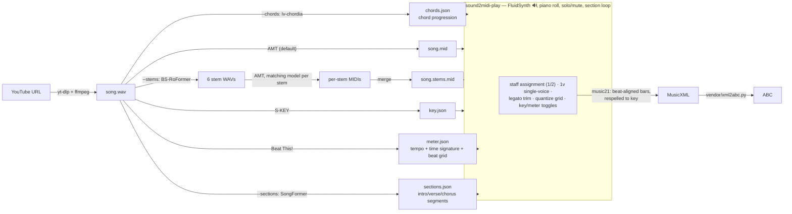

# sound2midi

Download a YouTube video's audio and transcribe it to MIDI using
[instrument-agnostic-amt](https://github.com/anime-song/instrument-agnostic-amt),
then play the result back with per-instrument solo/mute and a piano-roll view.

Built on the Astral stack: [`uv`](https://docs.astral.sh/uv/) for packaging,
[`ruff`](https://docs.astral.sh/ruff/) for lint/format, and
[`ty`](https://github.com/astral-sh/ty) for type checking.

## How it works



`sound2midi` itself is a lightweight orchestrator. Because the AMT project is a
script-based repo with a CUDA-pinned torch, it is **not** mixed into this project's
dependencies. Instead, on first use it is cloned into a cache directory with its own
`uv`-managed virtualenv, and its code is run as a subprocess.

## Requirements

- `uv`, `git`, and `ffmpeg` on your PATH.
- An NVIDIA GPU is strongly recommended. The AMT model pins `torch==2.7.0+cu128`
  (CUDA 12.8, with Blackwell/RTX-50 support). CPU inference works via `--device cpu`
  but is very slow.
- For the player: a FluidSynth soundfont. On Debian/Ubuntu: `sudo apt install
  fluid-soundfont-gm` (provides `/usr/share/sounds/sf2/FluidR3_GM.sf2`). The synth
  library itself ships with the `pyfluidsynth` wheel.

## Setup

```bash
uv sync                          # this project's deps + dev tools
uv sync --extra player           # ...also install the MIDI player GUI (PySide6 etc.)
uv run sound2midi --setup-only   # clone AMT + build its venv (downloads ~3GB of torch)
```

`--setup-only` is optional; the AMT environment is built automatically on first run.

## Transcribe

Each song gets its own folder under `output/` (override with `-O/--output-dir`):

```
output/<song>/
  <song>.wav         # downloaded audio
  <song>.mid         # single-model transcription
  <song>.stems.mid   # merged stem transcription (with --stems)
  artifacts/         # per-song analysis artifacts (JSON)
    <song>.key.json       # detected musical key (skey)
    <song>.meter.json     # detected tempo + time signature + beat grid (beat-this)
    <song>.sections.json  # song structure segments (SongFormer, with --sections)
    <song>.chords.json    # chord progression (lv-chordia, with --chords)
  musicxml/          # notation exports (MusicXML), written by the player
  abc/               # notation exports (ABC), written by the player
  stems/             # stem intermediates (separated WAVs + per-stem MIDIs)
```

```bash
# YouTube URL or bare id -> output/<id>/<id>.mid
uv run sound2midi "https://www.youtube.com/watch?v=VIDEO_ID"
uv run sound2midi VIDEO_ID

# Pick the model variant; transcribe a local file (kept in place, outputs still go to output/)
uv run sound2midi VIDEO_ID --type guitar
uv run sound2midi ./song.wav

# Force CPU / disable mixed precision / forward raw infer.py flags
uv run sound2midi <url> --device cpu --no-amp
uv run sound2midi <url> --infer-arg=--velocity --infer-arg=110
```

### Re-runs are cheap (idempotent)

The audio is reused if already downloaded, and transcription is skipped if the target
MIDI already exists. Pass `-f/--force` to redo from scratch.

### Single-model vs stem-separated

By default a single model transcribes the whole mix in one pass — fast, and the
baseline to compare against.

`--stems` replicates the upstream Colab's optional workflow: it separates the audio
into stems (bass / drums / other / vocals / guitar / piano via BS-RoFormer),
transcribes **each stem with its matching AMT model** (`drums→drums`, `bass→bass`,
`vocals→vocal_harmony`, `guitar→guitar`, `other→other`, else `default`), then merges
the per-stem MIDIs into one file. It's slower and downloads several model checkpoints,
but usually separates instruments more cleanly (e.g. it recovers a real drum track).

```bash
uv run sound2midi VIDEO_ID --stems          # -> output/<id>/<id>.stems.mid
uv run sound2midi VIDEO_ID --stems --no-drums
uv run sound2midi VIDEO_ID --stems --cleanup-stems   # delete separated WAVs afterward
```

The stem pipeline is **resumable**: already-separated stems and already-written per-stem
MIDIs are reused, and if the child process dies on a signal (an intermittent native
SIGSEGV has been seen in the torch/CUDA stack) it is retried once, picking up from the
stems already done. So if a run crashes mid-way, just run it again.

### Model variants (`--type`)

`default`, `bass`, `vocal`, `guitar`, `vocal_harmony`, `drums` (experimental), `other`.
Weights are fetched from Hugging Face (`anime-song/instrument_agnostic_amt`) on first use.

### Key detection

By default the song's key is detected from the full-mix audio with
[deezer/skey](https://github.com/deezer/skey) (S-KEY, the successor to STONE) and saved
to `<song>.key.json` (e.g. `{"key": "Bb minor", ...}`). The MIDI files are left
unchanged. Pass `--no-key` to skip it. skey is installed into the AMT venv on first use
(it reuses that environment's torch), so no extra heavy download.

### Tempo + time-signature detection

By default the song's beats and downbeats are tracked with
[Beat This!](https://github.com/CPJKU/beat_this) (CPJKU, ISMIR 2024) and distilled into
`<song>.meter.json`: time signature (mode of beats-per-bar between downbeats), tempo
(median inter-beat interval), and a compound-meter test that snaps the transcribed
MIDI's between-beat onsets to duple vs triple grids (a triple majority turns 2/4 into
6/8, etc.). The artifact stores the full beat/downbeat grid, which the exporter uses for
beat alignment. Pass `--no-meter` to skip. Like skey, it installs into the AMT venv on
first use (plain PyTorch, no madmom).

### Chord detection (`--chords`)

Opt-in: [lv-chordia](https://pypi.org/project/lv-chordia/) (openmirlab's package of the
ISMIR 2019 *Large-Vocabulary Chord Transcription* model) labels the full mix with
Harte-style chords — `C:maj`, `A:min7`, `E:maj/3` (inversions as chord degrees), `N`
for no-chord — saved to `<song>.chords.json`. Like skey and beat-this it installs into
the AMT venv on first use (plain pip package, rides its torch); a song takes a few
seconds. The player shows the progression as a chord strip, and the exporter can write
the symbols into the score (see below).

```bash
uv run sound2midi VIDEO_ID --chords
```

Chord recognition runs on the full mix by design — the model is trained on mixes, and
source-separation artifacts tend to hurt more than mix "noise" helps.

### Song structure detection (`--sections`)

Opt-in (it is the heaviest artifact): [SongFormer](https://github.com/ASLP-lab/SongFormer)
(ASLP-lab, state of the art in music structure analysis) segments the full mix into
labeled sections — intro, verse, pre-chorus, chorus, bridge, inst, outro, silence
(the SongForm-HX-8Class label set) — saved to `<song>.sections.json` as
`{"segments": [{"label": "chorus", "start": 45.2, "end": 78.9}, ...]}`.

```bash
uv run sound2midi VIDEO_ID --sections
```

SongFormer is a script-based repo (like the AMT project) that vendors MusicFM and
pins `torch==2.4.0`, which has no Blackwell (RTX 50) kernels — so unlike skey and
beat-this it does **not** ride the AMT venv. On first use it is cloned into its own
cache directory (`$SOUND2MIDI_SONGFORMER_HOME`, default
`~/.cache/sound2midi/songformer`) with its own uv venv built against the same
`torch==2.7.0+cu128` the AMT venv uses, and its checkpoints (SongFormer, MusicFM,
MuQ — several GB total) are downloaded. Inference itself takes a few seconds per
song on GPU; if CUDA is unavailable or unusable it falls back to CPU (slow but
fine for a one-time artifact).

In the player the artifact appears as a clickable **section strip** above the
instrument lanes (see below); section-scoped export and backing tracks are on the
Roadmap.

## Play (`sound2midi-play`)

A small PySide6 app that synthesizes a MIDI with FluidSynth and shows a **per-instrument
piano roll** — one lane per instrument, with the notes drawn over time (the gaps are the
rests) and a playhead that sweeps as it plays. Each lane has **Solo** and **Mute** so you
can hear instruments separately or together, and compare single-model vs `--stems` output.

```bash
uv sync --extra player                              # one-time
uv run sound2midi-play output/<id>/<id>.stems.mid   # open a file
uv run sound2midi-play                              # open empty, then File → Open
uv run sound2midi-play song.mid --soundfont /path/to/sf.sf2 --driver pulseaudio
```

- **Play / Pause / Stop**, a seek bar, master volume. Click anywhere on a lane to seek.
- Per-lane **Solo / Mute** (plus *Clear solo* / *Unmute all*); muted/non-soloed lanes dim.
- If a `<song>.sections.json` is present (from `--sections`), a **section strip** sits
  above the lanes: one colored block per detected section, repeats numbered (Verse 1,
  Chorus 2, …). Click sections to select them (click again to deselect): playback
  **loops the selection**, playing the selected sections in song order and skipping the
  gaps (a ⟳ indicator shows in the header), and exports are **cut to it**. Combined
  with Solo/Mute that covers "practice the guitar part over chorus 2".
- **Ctrl+click** an instrument's lane inside a section to toggle that
  (instrument, section) **cell** — "this instrument plays in this part" — shown as a
  tint in the track's color. Cells pick instruments per section for the export; a
  cell'd instrument doesn't need its staff box ticked (it defaults to staff 1).
- If a `<song>.chords.json` is present (from `--chords`), a **chord strip** shows the
  progression under the section strip: blocks colored by root pitch class (minor
  chords darker), labels where they fit (`F#m`, `B7`, `E/G#`), hover for the rest.
  Click to seek. The progression is also **playable**: it's realized as a synthesized
  piano track with its own **Solo/Mute** on the lane — muted by default, so press
  **S** to audition the chords alone, or untick **M** to comp along with the band.
  It follows seek and section loops like any track.
- Like the instrument lanes, the chord strip supports **Ctrl+click** to toggle the
  chord voice per section — pick "chords only in the chorus" without ticking its
  staff box (it lands on staff 1 unless assigned to 2).
- The lane's **style selector** picks the realization (playback *and* export):
  **block** (bass + root-position chord tones, one hit per chord), **smooth**
  (voice-led — each chord takes the inversion closest to the previous one),
  **arpeggio** (bass then chord tones cycled upward, one note per beat), or
  **bass** (the bass line alone). The lane also has **staff checkboxes**, making
  the realized chords a regular *voice* you can put on staff 1 or 2 of the export
  like any instrument.
- Soundfont search order: `--soundfont`, then `$SOUND2MIDI_SOUNDFONT`, then common system
  paths. Audio driver auto-selects; override with `--driver` or `$SOUND2MIDI_FLUID_DRIVER`.

### Export to notation (MusicXML / ABC)

Each lane has staff checkboxes — you assign instruments to staves yourself (no pitch
guessing). Pick a mode, tick instruments, then **Export selected →**:

- **Single staff** — tick **1** on the instruments you want; they're quantized and
  chordified onto one staff.
- **Grand staff (2)** — tick **1** (top/treble) or **2** (bottom/bass) per instrument to
  place it on that staff; the two are braced into a piano grand staff. Staves are padded
  with full-bar rests so both hands span the same length and stay bar-aligned.
- **Split (auto)** — tick **1** on one selection; the notes are split into a braced
  grand staff automatically around a **moving middle**: each bar's notes are divided
  into two hands by a two-cluster fit over all the bar's note events, so where the
  notes *mass* is decides the split — a lone genuine bass note still gets the bass
  staff, but a near-outlier is never stranded on the wrong side. A bar whose notes
  form one tight cluster stays whole on the nearer staff (melodies keep one hand),
  and the middle only stays put across bars while the division is unchanged. One
  voice selection in, piano-style two-hand notation out.

The **Grid** selector sets the notation quantization (default **1/16**, which yields clean
notes/rests with no tuplets; coarser = simpler, and `… + triplets` options are there when
you need them). Transcribed audio has micro-timing, so a sensible grid is what keeps the
score readable.

**Legato trim** (on by default) removes chordify's three sliver-chord artifacts, which
come from transcription timing noise: legato tails (A ringing into C → A/[A C]/C),
ragged chord attacks (a chord-mate arriving late → A/[A C]), and ragged releases (one
chord-mate ringing longer → [A C]/C). Tails up to 1.5 grid units are cut at the next
onset; attack/release raggedness under a grid slot is snapped together. Genuine chords,
long suspensions, and fast legato runs (notes a full slot apart) are preserved.

Each lane also has a **1v** (single voice) checkbox for melodic instruments: the track is
rebuilt so only the most recent attack sounds, and a held note *resumes* after an inner
note ends — which repairs pedal-tone artifacts like C / [B♭ C] / C into the actual melody
C, B♭, C (chords collapse to their top note). It is auto-checked for tracks that play
mostly one note at a time (polyphony ratio < 0.3) and can be toggled per lane.

If a `<song>.key.json` is present in the folder, its key is loaded and shown as a **Key:**
toggle (on by default). When applied, it is written as the score's key signature (skey's
theoretical spellings like "G# Major" are normalized to their common enharmonic, e.g. Ab
major) **and the notes are respelled to the key** — diatonic tones stay accidental-free and
chromatic tones use the key's flats/sharps (so an A# in a flat key becomes Bb), preserving
the sounding pitch. This is what makes the transcribed notation actually readable.

If a `<song>.meter.json` is present, a **Meter:** toggle appears (e.g. "4/4 ♩≈176", on by
default). When applied, the export is **retimed to the detected beat grid**: notes are
mapped from seconds to beat positions (piecewise-linear between tracked beats), the real
tempo and time signature are written into the score, and **bar 1 is anchored on the first
downbeat** (pickup notes get whole leading bars, identical across both staves). Without
this, the MIDI's flat default tempo (120) makes barlines and rhythm values arbitrary;
with it, a "1/16" on the grid selector is an actual sixteenth of the music.

If a `<song>.chords.json` is present, a **Chords:** toggle writes the detected chord
symbols above the top staff: snapped to the nearest beat of the beat grid, respelled
to the key (sharps/flats follow the key signature), repeats merged, no-chord spans
skipped. They come out as real `<harmony>` elements in MusicXML (Verovio renders
them) and as `"F#m"`-style annotations in ABC. With a section-cut export the symbols
are mapped into the cut windows.

Independently, the **realized chord voice** (the chord lane's staff checkboxes) can
be exported as actual notes on either staff, in the lane's selected style — e.g.
melody on staff 1, smooth-voiced chords on staff 2 of a grand staff. It passes
through the same beat retiming, quantization, and section windows as any track
(and is always kept in cell-restricted sections, since it has no cells of its own).

**Section-scoped export**: when sections are selected in the strip (or cells are set),
the export is cut to them — with Meter on, each section is snapped to whole bars of the
beat grid, and the windows are concatenated in song order so the score reads as one
continuous excerpt. The export window is the **union** of the strip selection and every
section that has cells, so a leftover loop selection never hides a cell'd section.
Per-section cells decide which instruments sound in that window (a section without
cells uses all staff-ticked instruments). The output gets a `.sections` name suffix.

The score is reduced to just **pitch + rhythm on a single Piano instrument** — the source
tracks' MIDI programs/channels are stripped, so there are no stray "instrument change"
entries cluttering (or breaking) the MusicXML.

Output is written into per-format subfolders of the song folder —
`musicxml/<midi>.<single|grand|split>.musicxml` and, if your `vendor/xml2abc.py` is
present, `abc/<midi>.<single|grand|split>.abc` (MusicXML → ABC via that script; set
`$SOUND2MIDI_XML2ABC` to point elsewhere) — keeping the song folder itself to the
audio, the MIDIs, and the pipeline artifacts. Conversion uses
[music21](https://web.mit.edu/music21/) (installed with the `player` extra).

### MusicXML → MEI (`sound2midi-mei`)

Converts exported MusicXML to [MEI](https://music-encoding.org/) with
[Verovio](https://www.verovio.org/) 5.7, prepending a **lead-in "measure 0"**
holding a single quarter rest (the convention the consuming trainer app
expects). The part's opening clef / key / time signature move onto the new
first measure so Verovio still lifts them into the top `<scoreDef>`; grand
staves get the rest in both staves and chord symbols pass through as `<harm>`
elements.

```bash
uv sync --extra mei                                                   # one-time
uv run sound2midi-mei output/<id>/musicxml/<id>.stems.single.musicxml
# -> output/<id>/mei/<id>.stems.single.mei
```

A file living in a `musicxml/` folder lands in a sibling `mei/` folder;
anything else gets a `.mei` written alongside it (`-o` overrides either way).
`--no-zero-measure` skips the lead-in bar, `--mei-version` retargets the
declared MEI version (default 5.1). The music21 round-trip's inflated timing
resolution (`@ppq` 10080) is rescaled to a clean 128, and Verovio's
`metcon="false"` flags on the incomplete lead-in bar are stripped.

## Options

| Flag | Meaning |
|------|---------|
| `-O, --output-dir` | Base dir for per-song folders (default `output`) |
| `-o, --output` | Explicit MIDI path (overrides the layout) |
| `-f, --force` | Re-download and re-transcribe even if outputs exist |
| `-t, --type` | AMT model variant (single-model mode) |
| `--stems` | Stem-separate, transcribe per stem, merge |
| `--no-drums` / `--cleanup-stems` | With `--stems`: skip drums / delete separated WAVs |
| `--device` | `cuda` (default if available) or `cpu` |
| `--no-amp` / `--amp-dtype` | Control mixed precision (default: on, `bf16`) |
| `--no-key` | Skip key detection (on by default; saved to `<song>.key.json`) |
| `--no-meter` | Skip tempo/time-signature detection (on by default; saved to `<song>.meter.json`) |
| `--sections` | Detect song structure with SongFormer (opt-in; saved to `<song>.sections.json`) |
| `--chords` | Detect the chord progression with lv-chordia (opt-in; saved to `<song>.chords.json`) |
| `--amt-home` | Where to keep the AMT checkout + venv |
| `--reinstall` | Rebuild the AMT venv from scratch |
| `--infer-arg` | Forward a raw flag to `infer.py` (repeatable) |

`$SOUND2MIDI_AMT_HOME` also sets the AMT location
(default: `~/.cache/sound2midi/instrument-agnostic-amt`), and
`$SOUND2MIDI_SONGFORMER_HOME` the SongFormer location
(default: `~/.cache/sound2midi/songformer`).

## Development

```bash
uv run ruff check        # lint
uv run ruff format       # format
uv run ty check          # type check
```

Layout:

- `src/sound2midi/download.py` — yt-dlp audio download (with id probe + cache reuse).
- `src/sound2midi/amt.py` — manage the AMT checkout/venv; single-model + stem modes.
- `src/sound2midi/_amt/stem_pipeline.py` — runs **inside the AMT venv**; faithful port of
  the Colab stem workflow (excluded from this package's lint/type-check surface).
- `src/sound2midi/_amt/key_detect.py` — runs **inside the AMT venv**; skey key detection.
- `src/sound2midi/_amt/meter_detect.py` — runs **inside the AMT venv**; Beat This! beat
  tracking + meter/tempo inference.
- `src/sound2midi/_amt/chords_detect.py` — runs **inside the AMT venv**; lv-chordia
  chord recognition.
- `src/sound2midi/sections.py` — manage the SongFormer checkout/venv (same pattern as
  `amt.py`); song-structure detection entry point.
- `src/sound2midi/_songformer/sections_detect.py` — runs **inside the SongFormer venv**;
  headless port of SongFormer's single-file inference (excluded from lint/type-check).
- `src/sound2midi/player/` — FluidSynth playback `engine`, `pianoroll` lanes,
  `sectionstrip` (clickable song-structure strip + loop), `chordstrip` + `chordlabel`
  (chord progression strip; Harte-label parsing shared with export), `export`
  (beat-aligned music21 → MusicXML/ABC with chord symbols), PySide6 window.

## Roadmap

Planned artifacts, mainly to feed [midi-stroke](https://github.com/vibetuned/midi-stroke)
(a MIDI-hardware training app that renders notation with Verovio):

- **MEI export** via [Verovio](https://www.verovio.org/) — native format for
  midi-stroke's renderer (MusicXML → MEI, or direct).
- **Transposition** — export parts for transposing instruments (Bb/Eb saxophone modes).
- **Background-music export** — render "everything except the practiced instrument" to
  audio as a backing track (the player engine's offline renderer already honors
  solo/mute, so this is a thin feature on top of the stems).
- **Section-scoped backing tracks** — apply the section cut to the backing-track
  render as well (the notation export already supports it).
- More per-song artifacts as midi-stroke needs them.

## References

Models and papers this pipeline builds on:

| Component | Repo | Paper |
|---|---|---|
| Transcription (AMT) | [anime-song/instrument-agnostic-amt](https://github.com/anime-song/instrument-agnostic-amt) | — |
| Stem separation | [stem-splitter](https://pypi.org/project/stem-splitter/) (BS-RoFormer) | Lu et al., *Music Source Separation with Band-Split RoPE Transformer*, ICASSP 2024 |
| Key detection | [deezer/skey](https://github.com/deezer/skey) | Kong et al., *S-KEY: Self-Supervised Learning of Major and Minor Keys from Audio*, ICASSP 2025; predecessor [deezer/stone](https://github.com/deezer/stone), *STONE: Self-Supervised Tonality Estimator*, ISMIR 2024 |
| Beat/downbeat tracking | [CPJKU/beat_this](https://github.com/CPJKU/beat_this) | Foscarin, Schlüter, Widmer, *Beat This! Accurate Beat Tracking Without DBN Postprocessing*, ISMIR 2024 |
| Song structure (sections) | [ASLP-lab/SongFormer](https://github.com/ASLP-lab/SongFormer) | Hao et al., *SongFormer: Scaling Music Structure Analysis with Heterogeneous Supervision*, arXiv 2025 |
| Chord recognition | [lv-chordia](https://pypi.org/project/lv-chordia/) ([music-x-lab](https://github.com/music-x-lab/ISMIR2019-Large-Vocabulary-Chord-Recognition)) | Jiang, Chen, Li, Xia, *Large-Vocabulary Chord Transcription via Chord Structure Decomposition*, ISMIR 2019 |

Tooling: [yt-dlp](https://github.com/yt-dlp/yt-dlp), [music21](https://github.com/cuthbertLab/music21)
(MIT, Cuthbert et al.), [mido](https://github.com/mido/mido),
[FluidSynth](https://www.fluidsynth.org/) / [pyfluidsynth](https://github.com/nwhitehead/pyfluidsynth),
[PySide6](https://doc.qt.io/qtforpython-6/), and Willem G. Vree's
[xml2abc / abc2xml](https://wim.vree.org/svgParse/) (vendored in `vendor/`).
